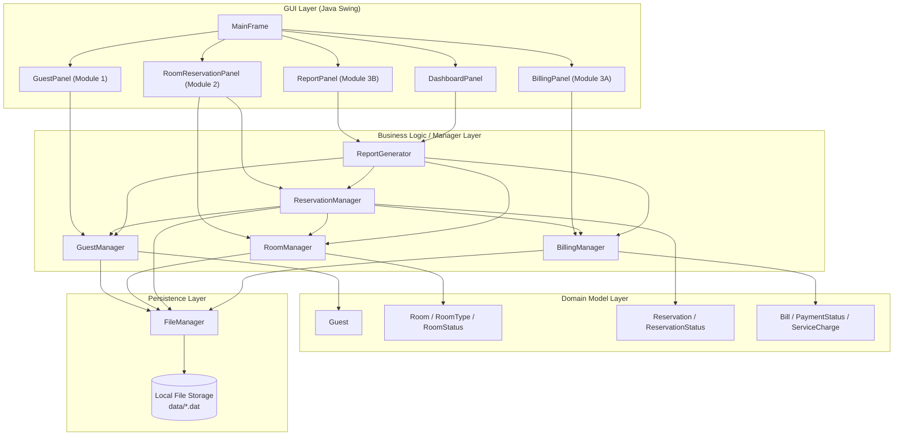

# System Architecture Diagram

```mermaid
graph TD
    subgraph UI Layer ["GUI Layer (Java Swing)"]
        MF["MainFrame"]
        DP["DashboardPanel"]
        GP["GuestPanel (Module 1)"]
        RRP["RoomReservationPanel (Module 2)"]
        BP["BillingPanel (Module 3A)"]
        RP["ReportPanel (Module 3B)"]
    end

    subgraph Manager Layer ["Business Logic / Manager Layer"]
        GM["GuestManager"]
        RM["RoomManager"]
        RSM["ReservationManager"]
        BM["BillingManager"]
        RG["ReportGenerator"]
    end

    subgraph Model Layer ["Domain Model Layer"]
        M1["Guest"]
        M2["Room / RoomType / RoomStatus"]
        M3["Reservation / ReservationStatus"]
        M4["Bill / PaymentStatus / ServiceCharge"]
    end

    subgraph Storage Layer ["Persistence Layer"]
        FM["FileManager"]
        DATA[("Local File Storage\ndata/*.dat")]
    end

    MF --> DP
    MF --> GP
    MF --> RRP
    MF --> BP
    MF --> RP

    GP --> GM
    RRP --> RM
    RRP --> RSM
    BP --> BM
    RP --> RG
    DP --> RG

    RSM --> GM
    RSM --> RM
    RSM --> BM
    RG --> RM
    RG --> GM
    RG --> RSM
    RG --> BM

    GM --> M1
    RM --> M2
    RSM --> M3
    BM --> M4

    GM --> FM
    RM --> FM
    RSM --> FM
    BM --> FM
    FM --> DATA
```
