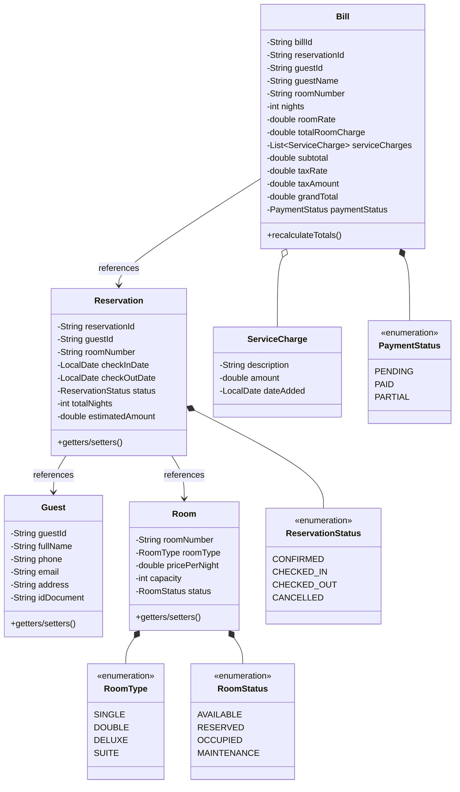

# Class Diagram

```mermaid
classDiagram
    class Guest {
        -String guestId
        -String fullName
        -String phone
        -String email
        -String address
        -String idDocument
        +getters/setters()
    }

    class Room {
        -String roomNumber
        -RoomType roomType
        -double pricePerNight
        -int capacity
        -RoomStatus status
        +getters/setters()
    }

    class RoomType {
        <<enumeration>>
        SINGLE
        DOUBLE
        DELUXE
        SUITE
    }

    class RoomStatus {
        <<enumeration>>
        AVAILABLE
        RESERVED
        OCCUPIED
        MAINTENANCE
    }

    class Reservation {
        -String reservationId
        -String guestId
        -String roomNumber
        -LocalDate checkInDate
        -LocalDate checkOutDate
        -ReservationStatus status
        -int totalNights
        -double estimatedAmount
        +getters/setters()
    }

    class ReservationStatus {
        <<enumeration>>
        CONFIRMED
        CHECKED_IN
        CHECKED_OUT
        CANCELLED
    }

    class Bill {
        -String billId
        -String reservationId
        -String guestId
        -String guestName
        -String roomNumber
        -int nights
        -double roomRate
        -double totalRoomCharge
        -List~ServiceCharge~ serviceCharges
        -double subtotal
        -double taxRate
        -double taxAmount
        -double grandTotal
        -PaymentStatus paymentStatus
        +recalculateTotals()
    }

    class ServiceCharge {
        -String description
        -double amount
        -LocalDate dateAdded
    }

    class PaymentStatus {
        <<enumeration>>
        PENDING
        PAID
        PARTIAL
    }

    Room *-- RoomType
    Room *-- RoomStatus
    Reservation *-- ReservationStatus
    Bill *-- PaymentStatus
    Bill o-- ServiceCharge
    Reservation --> Guest : references
    Reservation --> Room : references
    Bill --> Reservation : references
```
