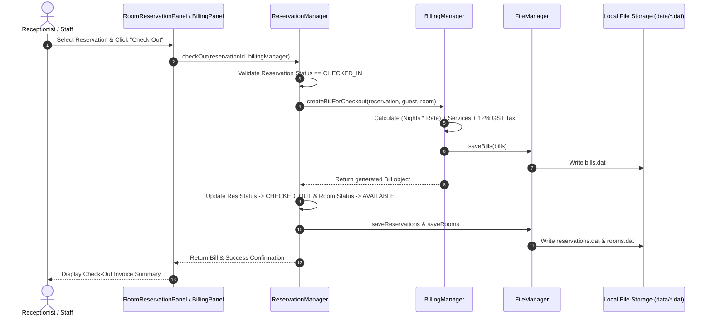

# Sequence Diagram - Reservation Check-Out and Invoicing

```mermaid
sequenceDiagram
    autonumber
    actor Staff as Receptionist / Staff
    participant UI as RoomReservationPanel / BillingPanel
    participant RM as ReservationManager
    participant BM as BillingManager
    participant FM as FileManager
    participant Store as Local File Storage (data/*.dat)

    Staff->>UI: Select Reservation & Click "Check-Out"
    UI->>RM: checkOut(reservationId, billingManager)
    RM->>RM: Validate Reservation Status == CHECKED_IN
    RM->>BM: createBillForCheckout(reservation, guest, room)
    BM->>BM: Calculate (Nights * Rate) + Services + 12% GST Tax
    BM->>FM: saveBills(bills)
    FM->>Store: Write bills.dat
    BM-->>RM: Return generated Bill object
    RM->>RM: Update Res Status -> CHECKED_OUT & Room Status -> AVAILABLE
    RM->>FM: saveReservations & saveRooms
    FM->>Store: Write reservations.dat & rooms.dat
    RM-->>UI: Return Bill & Success Confirmation
    UI-->>Staff: Display Check-Out Invoice Summary
```
