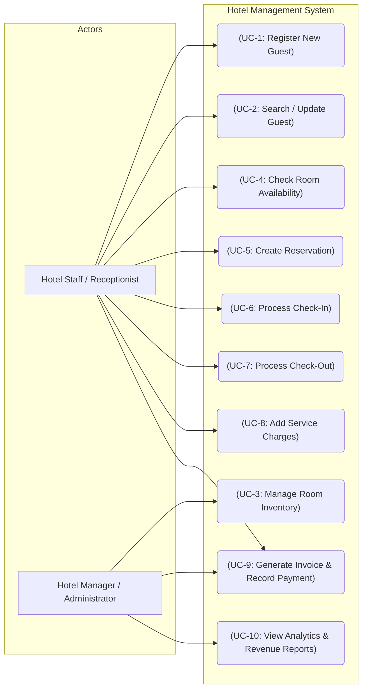

# Use Case Diagram

```mermaid
graph LR
    subgraph Actors
        Staff["Hotel Staff / Receptionist"]
        Admin["Hotel Manager / Administrator"]
    end

    subgraph System ["Hotel Management System"]
        UC1("(UC-1: Register New Guest)")
        UC2("(UC-2: Search / Update Guest)")
        UC3("(UC-3: Manage Room Inventory)")
        UC4("(UC-4: Check Room Availability)")
        UC5("(UC-5: Create Reservation)")
        UC6("(UC-6: Process Check-In)")
        UC7("(UC-7: Process Check-Out)")
        UC8("(UC-8: Add Service Charges)")
        UC9("(UC-9: Generate Invoice & Record Payment)")
        UC10("(UC-10: View Analytics & Revenue Reports)")
    end

    Staff --> UC1
    Staff --> UC2
    Staff --> UC4
    Staff --> UC5
    Staff --> UC6
    Staff --> UC7
    Staff --> UC8
    Staff --> UC9

    Admin --> UC3
    Admin --> UC9
    Admin --> UC10
```
