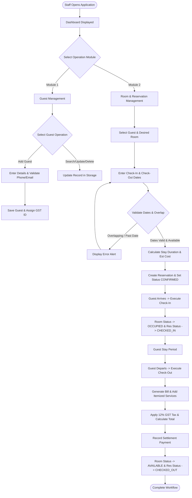

# Workflow & Process Flow Diagram

```mermaid
flowchart TD
    Start([Staff Opens Application]) --> Dash[Dashboard Displayed]
    Dash --> SelectMod{Select Operation Module}

    SelectMod -->|Module 1| G1[Guest Management]
    G1 --> G2{Select Guest Operation}
    G2 -->|Add Guest| G3[Enter Details & Validate Phone/Email]
    G3 --> G4[Save Guest & Assign GST ID]
    G2 -->|Search/Update/Delete| G5[Update Record in Storage]

    SelectMod -->|Module 2| R1[Room & Reservation Management]
    R1 --> R2[Select Guest & Desired Room]
    R2 --> R3[Enter Check-In & Check-Out Dates]
    R3 --> R4{Validate Dates & Overlap}
    R4 -->|Overlapping / Past Date| R5[Display Error Alert]
    R5 --> R3
    R4 -->|Dates Valid & Available| R6[Calculate Stay Duration & Est Cost]
    R6 --> R7[Create Reservation & Set Status CONFIRMED]

    R7 --> CheckIn[Guest Arrives -> Execute Check-In]
    CheckIn --> RoomOcc[Room Status -> OCCUPIED & Res Status -> CHECKED_IN]
    RoomOcc --> Stay[Guest Stay Period]

    Stay --> CheckOut[Guest Departs -> Execute Check-Out]
    CheckOut --> Billing[Generate Bill & Add Itemized Services]
    Billing --> Tax[Apply 12% GST Tax & Calculate Total]
    Tax --> Pay[Record Settlement Payment]
    Pay --> RoomAvail[Room Status -> AVAILABLE & Res Status -> CHECKED_OUT]
    RoomAvail --> End([Complete Workflow])
```
